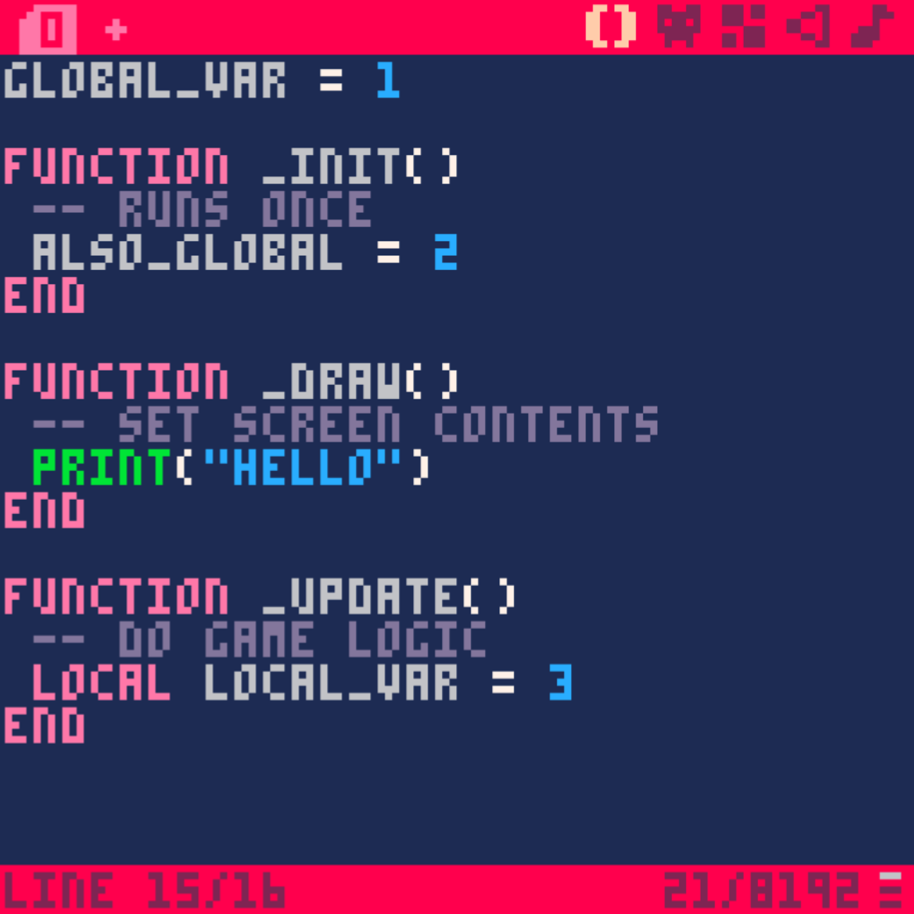

# Hello, Sprites!
## Goal
Move a sprite around with the D-pad
## Tasks
1. Create a sprite with the sprite editor
2. Draw the sprite on the screen with an initial location
3. Move the sprite with the four arrow buttons
## Useful Info
### Shortcuts
- **ESC** - open/ close the IDE
- **CTRL/ CMD + R** - run your program
- **SHIFT + [u|d|l|r|x|o]** - type a special character that corresponds to one of the pressable buttons
### Terminal commands
- `cd / ls` - does what you think it does
- `save [filename]` - save your code
- `load [filename]` - load a code file
- `help` - view list of terminal commands
### The Three Callbacks

### New API's
[SPR](https://www.lexaloffle.com/dl/docs/pico-8_manual.html#SPR) - draw a sprite
[BTN](https://www.lexaloffle.com/dl/docs/pico-8_manual.html#BTN) - respond to a button press
## How to code it
### 1. Make a sprite
The second tab in the IDE is the sprite editor. It's pretty WYSIWYG.
### 2. Code it
No special instructions here, just paste this in.
```
function _init()
 -- set initial position
 x = 64
 y = 64
end

function _draw()
 cls()
 spr(0,x,y)
end

function _update()
 if (btn(➡️)) then
  x+=1
 end
 if (btn(⬅️)) then
  x-=1
 end
 if (btn(⬆️)) then
  y-=1
 end
 if (btn(⬇️)) then
  y+=1
 end
end
```