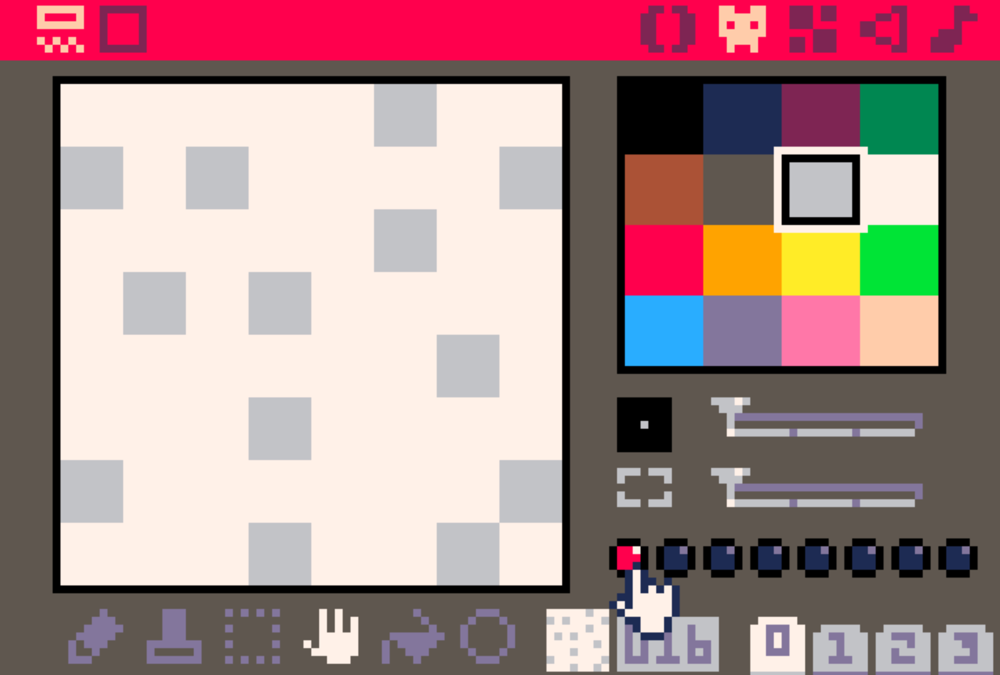

# Moving about a map with gravity
## Goal
Apply collision/ gravity and make your sprite move on top of the map tiles
## Tasks
1. Add collision detection
2. Apply gravity to sprite
3. Add jump button
## Useful info
### New API's

## How to code it
### 1. Set collision bit on map sprite


### 2. Refactor player variables into table
Replace your `_init()` with this:
```lua
function _init()
 player = {
  x = 64,
  y = 64,
  dx = 0,
  dy = 0,
  spd = 1,
  jump = 1,
  on_ground = 0
 }
end
```
Also add a constant above `_init()`:
```lua
-- constants
max_speed = 1.5
```


### 3. Refactor update to use player table
Replace your `_update()` function with this `_update60()` function (supports 60 FPS):
```lua
function _update60()
 local p = player
 -- apply gravity
 p.dy=p.dy+0.05
 -- left/ right
 if (btn(➡️)) then
  p.dx=p.dx+0.05
 end
 if (btn(⬅️)) then
  p.dx=p.dx-0.05
 end

 -- decel if on ground
 if p.on_ground then
  p.dx=p.dx*0.97
  p.jump=0
 end

 -- max acceleration
 if p.dx > max_speed then
  p.dx = max_speed
 end

 -- update forward/ upward motion
 p.y=p.y+p.dy
 p.x=p.x+p.dx
```
At this point, the player should be able to move left/ right, but will fall through the floor.

### 4. Add a map tile collision function
Create a second code tab (tab 1), and add this:
```lua
-- collision function
function hit(x,y,w,h,flag)
 collide=false

 for i=x,x+w,w do
  if (fget(mget(i/8,y/8))==flag) or
         (fget(mget(i/8,(y+h)/8))==flag) then
   collide=true
  end
 end

 return collide
end
```

Now, add collision to `_update60()` directly after your button presses:
```lua
 -- check wall coll
 if hit(p.x+p.dx,p.y,7,7,1) then
  player.dx=0
 end

 -- check ground coll
 if hit(p.x,p.y+p.dy,7,7,1) then
  if p.dy>0 then
   p.on_ground=true
  end
   p.dy=0
 end
```
At this point, the sprite should stop falling through the floor

### 5. Add jump
Add this directly after your left/ right button presses:
```lua
 -- jump
 if btnp(🅾️) and
   (p.on_ground or p.jump<1) then
   p.on_ground=false
   p.jump+=1
   p.dy=p.dy-2
 end
 ```