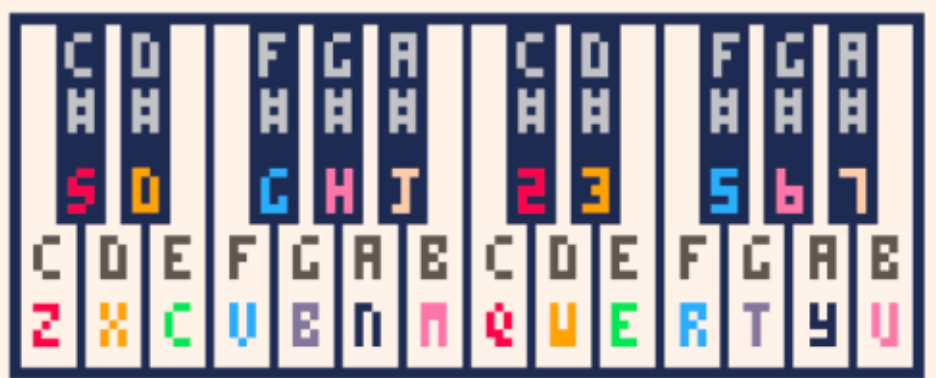
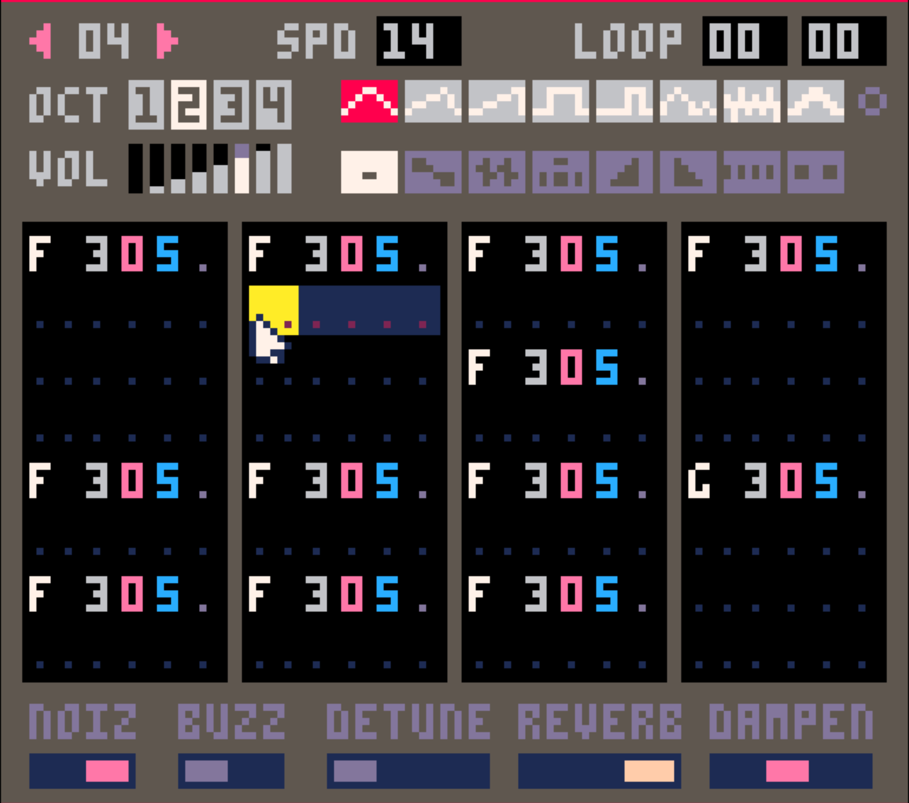

# Music and SFX
## Goal
Make an annoying music loop and a jump sound
## Tasks
1. Make some music with the SFX/ Music composer
2. Start the music when the game starts and end it on game over
3. Add a sound when the player jumps
## Useful info
The keyboard piano keyboard on your computer keyboard

### New API's
[SFX](https://www.lexaloffle.com/dl/docs/pico-8_manual.html#SFX)
```
SFX(N, [CHANNEL], [OFFSET], [LENGTH])
Play sfx N (0..63) on CHANNEL (0..3) from note OFFSET (0..31 in notes) for LENGTH notes.
```
[MUSIC](https://www.lexaloffle.com/dl/docs/pico-8_manual.html#MUSIC)
```
MUSIC(N, [FADE_LEN], [CHANNEL_MASK])
Play music starting from pattern N (0..63)
N -1 to stop music

FADE_LEN is in ms (default: 0)
```
## How to ~~code~~ compose it
### 1. Compose your music
[Go to Kesha](#kesha---tik-tok)

[Go to Dua Lipa](#dua-lipa---levitating)

[Go to Taylor Swift](#taylor-swift---anti-hero)

### 2. Play the music when the game starts
Play music in `_init()`:
```lua
music(0)
```

Stop the music in the game over condition in `_update60()`:
```lua
music(-1)
```

### 3. Add a sound effect when the player jumps
Compose one more track for a jump sound. Play around with it (maybe use the level composer) and see what sounds good.

Then, play that sound effect when the player jumps in `_update60()`:
```
sfx(12)
```

---

### Kesha - TiK ToK
#### Vocal (melody) track


_🎵Don't stop, make it pop, DJ, blow my speakers up🎵_


_🎵Tonight, I'ma fight, 'Til we see the sunlight🎵_


_🎵Tick-tock on the clock, But the party don't stop, no🎵_


_🎵Oh, whoa, whoa-oh, Oh, whoa, whoa-oh🎵_

#### Bass track
This plays over the first 3 vocal SFX


This plays over the last vocal SFX


#### Drum track
Repeat this for the entire loop


---

### Dua Lipa - Levitating

#### Vocal (melody) track


_🎵You want me, I want you, baby, My sugarboo, I'm levitating🎵_


_🎵The Milky Way, we're renegading, Yeah, yeah, yeah, yeah, yeah🎵_


_🎵I got you, moonlight, you're my starlight🎵_


_🎵I need you all night, come on, dance with me, I'm levitating🎵_

#### Bass track
This repeats for the whole loop


#### Drum track
Repeat this for the entire loop


---

### Taylor Swift - Anti-Hero

#### Vocal (melody) track

Repeat this SFX twice


_🎵It's me, hi, I'm the problem, it's me🎵_

_🎵At tea time, everybody agrees🎵_

Layer this SFX on top of those two repeated bars


Then finish up with these last two bars...


_🎵I'll stare directly at the sun but never in the mirror🎵_


_🎵It must be exhausting, always rooting for the anti-hero🎵_

#### Bass track
This repeats for the whole loop


#### Drum track
Repeat this for the entire loop


