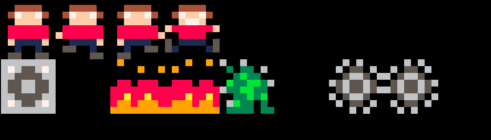

# Animation
## Goal
Make the world more life-like by animating it
## Tasks
1. Change the sprite on jump
2. Create a 2-frame walk/ run animation as the player moves left/ right
3. Animate the lava with map switching
4. Animate the evil wall with more traditional timed sprite animation
## Useful info
### New API's
Nothing new here! Just expanding our use of `SPR` and `MAP`.
## How to code it
These are arranged in order of level of difficulty

### 1. Rearrange your sprites
Give yourself some space on the sprite sheet so you can put animation frames next to each other. Test your game to make sure you didn't break any sprites!



### 2. Create frames of animation
Using your new space, create the following additional frames:
- Change your one player sprite into two sprites with a walking motion between them (e.g., feet move)
- Add a single sprite to represent jumping
- Create a second lava frame (e.g., lava bubbling)
- Create a second evil wall frame (e.g., spikes moving in and out)

### 3. Change the sprite on jump
Update the player in `_draw()` to show a different sprite when jumping
```lua
if (p.jump >= 1) then
 -- jumping sprite
 spr(2,p.x,p.y)
else
 -- not jumping sprite
 spr(1,p.x,p.y)
end
```

🏃**Try it!** Funny how much more life-like this thing looks with one simple animation

### 4. Animate the evil wall
Add a global animation timer matching the frame/ second in `_init()`
```lua
 g_time = 0
```

Update it at the end of `_update60()`:
```lua
-- global animation
g_time = g_time + 1
if (g_time > 60) then
 g_time = 0
end
```

Update the evil wall X times per second using the timer in `_draw()`:
```diff
for i=0,15 do
--spr(7,wall.x,i*8)
++spr(g_time % 6 <= 3 and 7 or 8,wall.x,i*8)
end
```
(the and/ or notation is a substitute for the ternary operator)

🏃**Try it!** What else could we use this global timer for...?

### 5. Animate the sprite on run
Add a `time = 0` field to the `player` table in `_init()`.

Then update this in `_update60()`:
```lua
p.time = p.time + p.dx
if (p.time >= max_speed * 2) then
 p.time = 0
end
```
(this causes time to roll over every two frames at max speed)

Then, update the player being drawed to alternate sprites:
```diff
if (p.jump >= 1) then
 spr(3,p.x,p.y)
else
--spr(1,p.x,p.y)
++spr(p.time < max_speed and 1 or 2,p.x,p.y)
end
```

🏃**Try it!** 'nuff said.

### 6. Animate the lave with map switching
This is a bit of a mind-bend, so let's just replace the entire `set_map_x()` on tab 2:
```lua
-- set a single space on map
function set_map_x(flr_hgt,x)
	-- clear
	for j=0,17 do
  mset(x,j,24)
 end
 for j=0,flr_hgt do
  -- negative nums make no floors
		mset(x,15-j,16)
		-- animation map swap
		mset(x,16,16)
	end
	-- make lava
	if flr_hgt < 1 then
	 mset(x,15,LAVA_SPRITE1)
	 -- animation map swap
	 mset(x,16,LAVA_SPRITE2)
	end
end
```

Now, in `_draw()` replace the map-drawing code with this:
```lua
-- draw all but bottom row
map(0,0,0,0,128,15)
-- animate map
map(0,g_time >= 30 and 15 or 16,0,120,128,1)
```
